# Project2
# Project2
# WEB STACK IMPLEMENTATION (LEMP STACK)
 
 
This project is similar to the first project that I did. However, instead of installing a LAMP stack, I will be installing a  LEMP stack. In this, stack we still be operating under linux, using apache, and PHP. What makes this stack different from the others is that it incorporates Nginx web server. The E in LEMP is for Nginx, which is pronounced as “Engine-X”.
 
Also, in the last project, I used the VIM editor; but in this project, I will be using Nano. Therefore, I suggest for anyone trying this project to become familiar with the Nano editor beforehand.
 
In this project, we will:
1. Install the Nginx Server
2. Install MySQL
3. Install PHP
4. Configure Nginx to use PHP Processor
5. Test PHP with Nginx.
6. Retrieve data from MySQL database with PHP
 
Prerequisites:
* AWS account with IAm User:
 
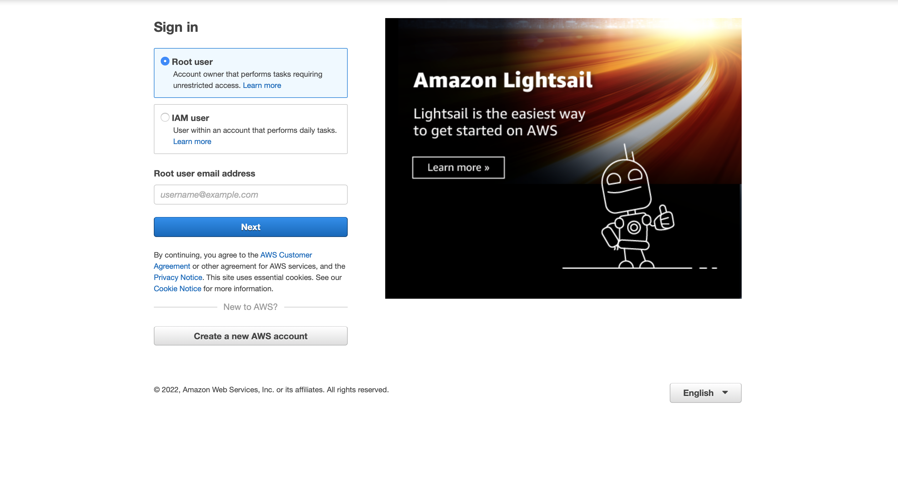
* EC2 Instance with Ubuntu Server 20.04 (HVM) SSD Volume Type:
 
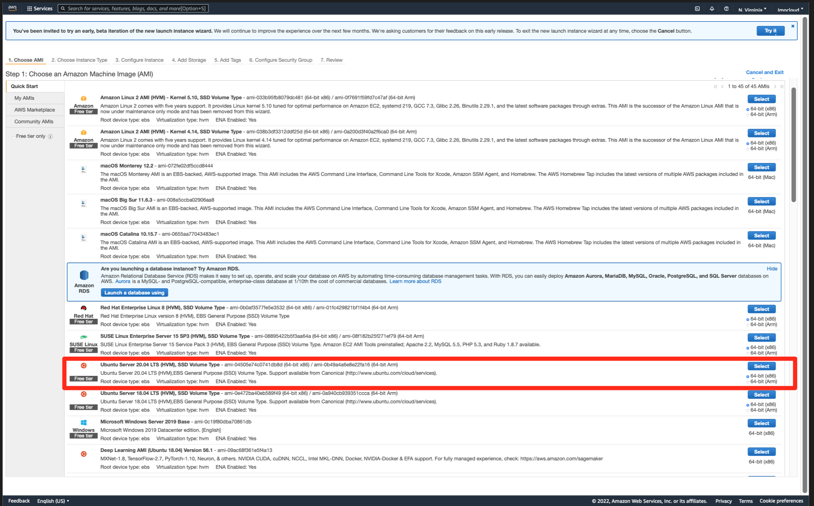
 
* And for your launched EC2 Instance to be connected to your computer's local server. For this project, I used my terminal.
 
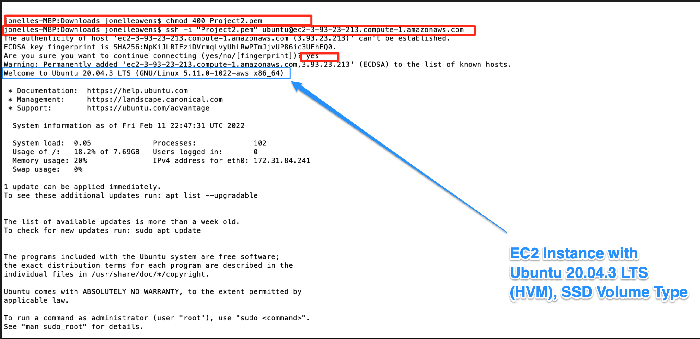
 
# Step 1 Installing the Nginx Web Server
 
Nginx is a high performing web server that allows our webpages to be displayed for our visitors.
 
In order to install Nginx, we will be utilizing the "apt" package manager.
 
Let's get started:
1. `$ sudo apt update`
2. `$ sudo apt install nginx`
 
   When prompted, enter Y to confirm that you want to install Nginx. Once the installation is finished, the Nginx web server will be active and running on your Ubuntu 20.04 server.
3. `$ sudo systemctl status nginx`
 
   This is to verify that Nginx was properly installed.
   If it is green and running, then you did everything correctly - you have just launched your first Web Server in the Clouds!
 
   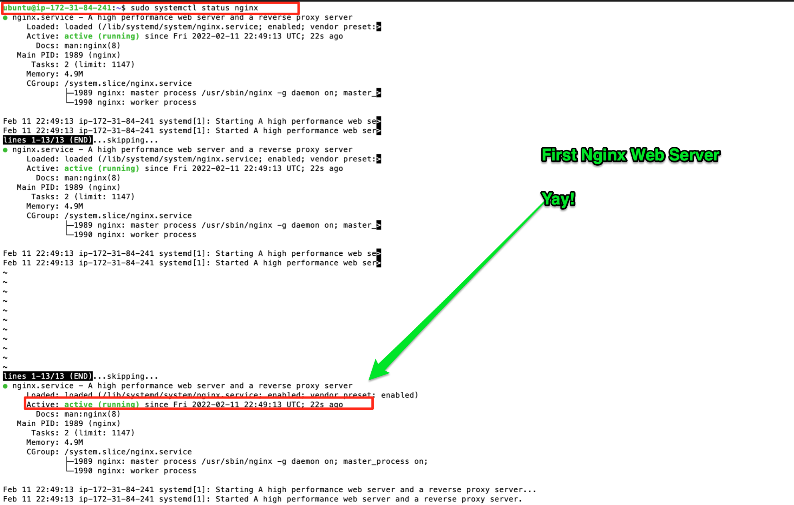
 
4. Before, we can view our webpage in the brower, we will need to add our inbound security setting under our Ubuntu EC2 setting...
 
.gif)
 
5. `$ curl http://localhost:80
       or
      $ curl http://127.0.0.1:80`
 
   These 2 commands above actually do pretty much the same - they use ‘curl’ command to request our Nginx on port 80 (actually you can even try to not specify any port - it will work anyway). The difference is that: in the first case we try to access our server via DNS name and in the second one - by IP address (in this case IP address 127.0.0.1 corresponds to DNS name ‘localhost’ and the process of converting a DNS name to IP address is called “resolution”). We will touch DNS in further lectures and projects.
 
6. Now let's check to see if our Nginx server is responding: 
`http://<Public-IP-Address>:80`
 
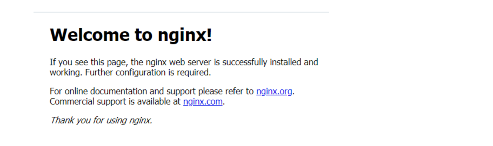
 
# Step 2 — Installing MySQL
 
If you remember from project 1, we needed a Database Management System (DBMS) to store and manage data for our site. For this, we will use MySQL, which is a popular relational database management system used within PHP environments, so we will use it in our project.
 
1. `$ sudo apt install mysql-server`
 
   When prompted, confirm installation by typing Y, and then ENTER.
2. When the installation is finished, it’s recommended that you run a security script that comes pre-installed with MySQL. This script will remove some insecure default settings and lock down access to your database system. Start the interactive script by running:
 
   `$ sudo mysql_secure_installation`
 
* This will ask if you want to configure the VALIDATE PASSWORD PLUGIN.
* Answer Y for yes, or anything else to continue without enabling.
* Press Y Password Plugin Validation
* I entered 0 for a low security and to help with my flow and entered a simple password. However, you can select 1, or 2 for a stronger security password.
* The last question you will be asked is "If you wish to continue with the password provide?" type Y for yes.
 
* For the rest of the questions, press Y and hit the ENTER key at each prompt. This will remove some anonymous users and the test database, disable remote root logins, and load these new rules so that MySQL immediately respects the changes you have made.
 
3. When you’re finished, test if you’re able to log in to the MySQL console by typing:
 
   `$ sudo mysql`
  
   This will connect to the MySQL server as the administrative database user root, which is inferred by the use of sudo when running this command. You should see output like this:
 
   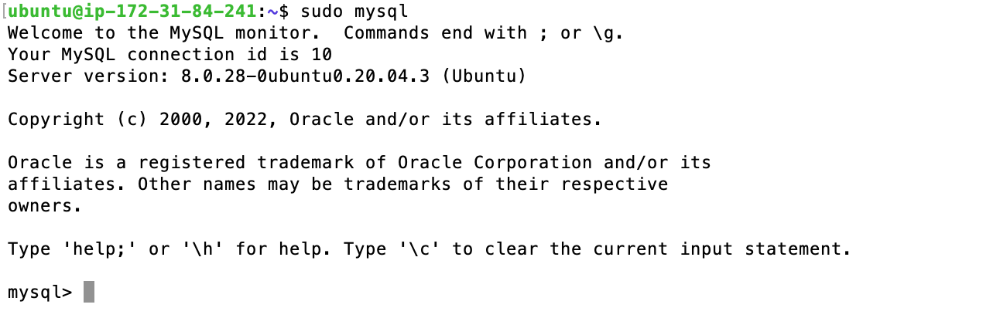
 
4. `mysql> exit`
 
# Step 3 – Installing PHP
 
You have Nginx installed to serve your content and MySQL installed to store and manage your data. Now you can install [PHP](https://www.php.net/) to process code and generate dynamic content for the web server.
 
While Apache embeds the PHP interpreter in each request, Nginx requires an external program to handle PHP processing and act as a bridge between the PHP interpreter itself and the web server. This allows for a better overall performance in most PHP-based websites, but it requires additional configuration. You’ll need to install `php-fpm`, which stands for “PHP fastCGI process manager”, and tell Nginx to pass PHP requests to this software for processing. Additionally, you’ll need `php-mysql`, a PHP module that allows PHP to communicate with MySQL-based databases. Core PHP packages will automatically be installed as dependencies.
 
To install these 2 packages at once, run:
 
1. `$ sudo apt install php-fpm php-mysql`
 
   When prompted, type `Y` and press `ENTER` to confirm installation.
 
You now have your PHP components installed. Next, you will configure Nginx to use them.
 
# Step 4 — Configuring Nginx to Use PHP Process
 
When using the Nginx web server, we can create server blocks (similar to virtual hosts in Apache) to encapsulate configuration details and host more than one domain on a single server. In this guide, we will use **projectLEMP** as an example domain name.
 
On Ubuntu 20.04, Nginx has one server block enabled by default and is configured to serve documents out of a directory at `/var/www/html`. While this works well for a single site, it can become difficult to manage if you are hosting multiple sites. Instead of modifying `/var/www/html`, we’ll create a directory structure within `/var/www` for the **your_domain** website, leaving `/var/www/html` in place as the default directory to be served if a client request does not match any other sites.
 
1. Create the root web directory for **your_domain** as follows:
 
   `$ sudo mkdir /var/www/projectLEMP`
 
2. Assign ownership of the directory with the $USER environment variable, which will reference your current system user:
 
   `$ sudo chown -R $USER:$USER /var/www/projectLEMP`
3. Then, open a new configuration file in Nginx’s `sites-available` directory using your preferred command-line editor. Here, we’ll use `nano`:
 
`$ sudo nano /etc/nginx/sites-available/projectLEMP`
 
4. This will create a new blank file. Paste in the following bare-bones configuration:
 

* `Control^X`
* `Y`
* `ENTER`
 
FYI:
      
   - `listen` — Defines what port Nginx will listen on. In this case, it will listen on port `80`, the default port for HTTP.
   - `root` — Defines the document root where the files served by this website are stored.
   - `index`— Defines in which order Nginx will prioritize index files for this website. It is a common practice to list `index.html` files with a higher precedence than `index.php` files to allow for quickly setting up a maintenance landing page in PHP applications. You can adjust these settings to better suit your application needs.
   - `server_name` — Defines which domain names and/or IP addresses this server block should respond for. **Point this directive to your server’s domain name or public IP address**.
   - `location /` — The first location block includes a `try_files` directive, which checks for the existence of files or directories matching a URI request. If Nginx cannot find the appropriate resource, it will return a 404 error.
   - `location ~ \.php$` — This location block handles the actual PHP processing by pointing Nginx to the fastcgi-php.conf configuration file and the `php7.4-fpm.sock file`, which declares what socket is associated with `php-fpm`.
   - `location ~ /\.ht`— The last location block deals with `.htaccess` files, which Nginx does not process. By adding the deny all directive, if any `.htaccess` files happen to find their way into the document root ,they will not be served to visitors.
 
 
5. Activate your configuration by linking to the config file from Nginx’s sites-enabled directory:
 
   `$ sudo ln -s /etc/nginx/sites-available/projectLEMP /etc/nginx/sites-enabled/`
 
   This will tell Nginx to use the configuration next time it is reloaded.
6. You can test your configuration for syntax errors by typing:
 
   `$ sudo nginx -t`
 
   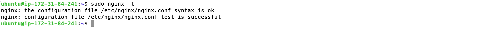
7. We also need to disable default Nginx host that is currently configured to listen on port 80, for this run:
 
   `sudo unlink /etc/nginx/sites-enabled/default`
 
8. When you are ready, reload Nginx to apply the changes:
 
   `$ sudo systemctl reload nginx`
 
9. Your new website is now active, but the web root /var/www/projectLEMP is still empty. Create an index.html file in that location so that we can test that your new server block works as expected:
 
   `sudo echo 'Hello LEMP from hostname' $(curl -s http://169.254.169.254/latest/meta-data/public-hostname) 'with public IP' $(curl -s http://169.254.169.254/latest/meta-data/public-ipv4) > /var/www/projectLEMP/index.html`
 
10. Now go to your browser and try to open your website URL using IP address:
 
   `http://<Public-IP-Address>:80`
 
   If you see the text from ***‘echo’*** command you wrote to index.html file, then it means your Nginx site is working as expected. In the output you will see your server’s public hostname (DNS name) and public IP address.
 
   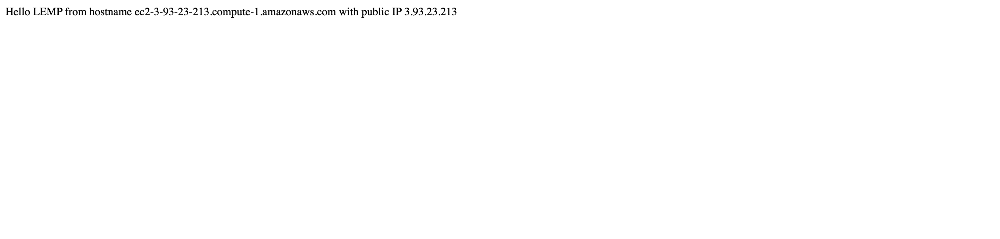
   Your LEMP stack is now fully configured. In the next step, we’ll create a PHP script to test that Nginx is in fact able to handle `.php` files within your newly configured website.
 
 
# Step 5 – Testing PHP with Nginx
 
Your LEMP stack should now be completely set up.
 
At this point, your LAMP stack is completely installed and fully operational.
 
You can test it to validate that Nginx can correctly hand `.php` files off to your PHP processor.
 
1. You can do this by creating a test PHP file in your document root. Open a new file called `info.php` within your document root in your text editor:
 
   `$ nano /var/www/projectLEMP/info.php`
 
2. Type or paste the following lines into the new file. This is valid PHP code that will return information about your server:
 
`<?php`
 
`phpinfo();`
 
3. You can now access this page in your web browser by visiting the domain name or public IP address you’ve set up in your Nginx configuration file, followed by `/info.php`:
 
   `http://server_domain_or_IP/info.php`
 
   You will see a web page containing detailed information about your server:
 
   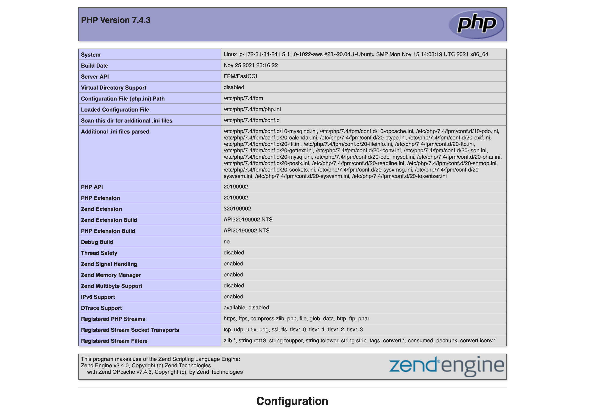
 
4. After checking the relevant information about your PHP server through that page, it’s best to remove the file you created as it contains sensitive information about your PHP environment and your Ubuntu server. You can use `rm` to remove that file:
 
   `$ sudo rm /var/www/your_domain/info.php`
 
   You can always regenerate this file if you need it later.
 
# Step 6 — Retrieving data from MySQL database with PHP
 
In this step you will create a test database (DB) with simple “To do list” and configure access to it, so the Nginx website would be able to query data from the DB and display it.
 
At the time of this writing, the native MySQL PHP library `mysqlnd` doesn’t support `caching_sha2_authentication`, the default authentication method for MySQL 8. We’ll need to create a new user with the `mysql_native_password` authentication method in order to be able to connect to the MySQL database from PHP.
 
We will create a database named **example_database** and a user named **example_user**, but you can replace these names with different values.
 
1. Connect to the MySQL console using the **root** account:
 
   `$ sudo mysql`
 
2. To create a new database, run the following command from your MySQL console:
 
   `mysql> CREATE DATABASE `example_database`;`
 
3. The following command creates a new user named `example_user`, using mysql_native_password as default authentication method. We’re defining this user’s password as `password`, but you should replace this value with a secure password of your own choosing.
 
   `mysql>  CREATE USER 'example_user'@'%' IDENTIFIED WITH mysql_native_password BY 'password';`
 
4. To give this user permission over the `example_database` database:
 
   `mysql> GRANT ALL ON example_database.* TO 'example_user'@'%';`
 
   This will give the **example_user** user full privileges over the **example_database** database, while preventing this user from creating or modifying other databases on your server.
 
5. Now exit the MySQL shell with:
 
   `mysql> exit`
 
6. You can test if the new user has the proper permissions by logging in to the MySQL console again, this time using the custom user credentials:
 
   `$ mysql -u example_user -p`
 
   Notice the `-p` flag in this command, which will prompt you for the password used when creating the `example_user` user.
 
7. After logging in to the MySQL console, confirm that you have access to the `example_database` database:
 
   `mysql> SHOW DATABASES;`
 
   This will give you the following output:
 
   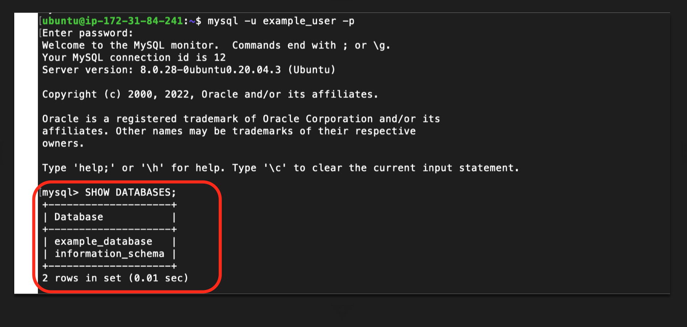
 
8. Next, we’ll create a test table named **todo_list**. From the MySQL console, run the following statement:
 
   `mysql> CREATE TABLE example_database.todo_list (item_id INT AUTO_INCREMENT,content VARCHAR(255),PRIMARY KEY(item_id));`
 
9. Insert a few rows of content in the test table. You might want to repeat the next command a few times, using different VALUES:
 
   `mysql> INSERT INTO example_database.todo_list (content) VALUES ("My first important item");`
 
10. To confirm that the data was successfully saved to your table, run:
 
   `mysql>  SELECT * FROM example_database.todo_list;`
 
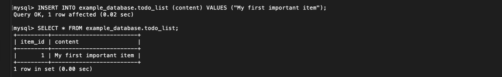
 
 
11. After confirming that you have valid data in your test table, you can exit the MySQL console:
 
   `mysql> exit`
 
12. Now you can create a PHP script that will connect to MySQL and query for your content. Create a new PHP file in your custom web root directory using your preferred editor. We’ll use vi for that:
 
   `$ nano /var/www/projectLEMP/todo_list.php`
 
13. The following PHP script connects to the MySQL database and queries for the content of the **todo_list** table, displays the results in a list. If there is a problem with the database connection, it will throw an exception.
 
 
Copy this content into your `todo_list.php` script:
 
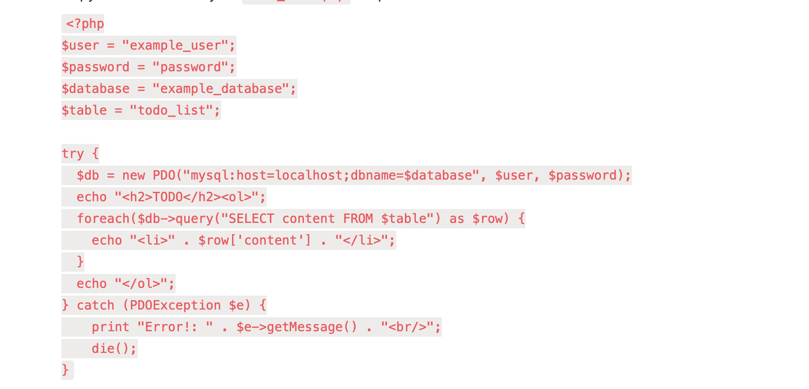
 
* Save and close out of the nano editor.
 
14. You can now access this page in your web browser by visiting the domain name or public IP address configured for your website, followed by `/todo_list.php:`
 
`http://<Public_domain_or_IP>/todo_list.php`
 
You should see a page like this, showing the content you’ve inserted in your test table:
 

 
Cheers! We've made it through another project!
 

 
 
 
 
 
 
 
 
          
 
 
 
 
 
 
 

